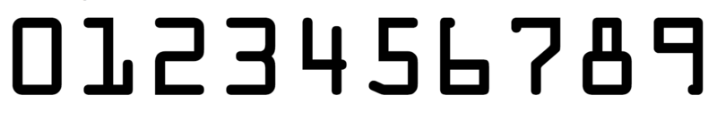

# Credit/Debit Card-OCR

Its an OPENCV-based project to read Account Number , Card Type , and Account Holder Name from Credit/Debit Card . 

Usually OCR (Tesseract) is used to read text from images . but here the text written is in different font , so that will not work here.

So here Template matching technique is used with a different font(digits and aphabets separately) to extract the associated credit card digits/alphabets from images.

# Process : 

1. Localize the four groupings of four digits on a credit card.
2. Extract each of these four groupings followed by segmenting each of the sixteen numbers individually.
3. Recognize each of the sixteen credit card digits by using template matching and the OCR-A FONT.

# Steps :

1. Clone this Repo.
2. pip install > requirements.txt
3. Run Command :  python final_card_ocr.py -image IMAGE_PATH 

# Font-Images:

  
   

# Results : 

  

Account No. : 4000 1234 5678 9010

Card Type   : VISA

Name        : VALUED CARDMEMBER

  

Account No. : 4020 3400 0234 5678

Card Type   : VISA

Name        : CU MEMBER

  

Account No. : 5412 7512 3456 7890

Card Type   : MasterCard

Name        : BB ANN HFYOND

  

Account No. : 4000 1234 5678 9010

Card Type   : VISA

Name        : YOUR NAME HERE

  

Account No. : 5476767898765432

Card Type   : MasterCard

Name        : COMPANX NAME M STEPHCNS

# Notes :

1. It will not work on Indian Debit/Credit Cards as Indian card has a different Font and also each bank has their own FontStyle(Big Problem)
2. As You can see in the results (100% correct to recognize Digits) but (80% correct to recognize alphabets)...so any kind of help is most welcome.
